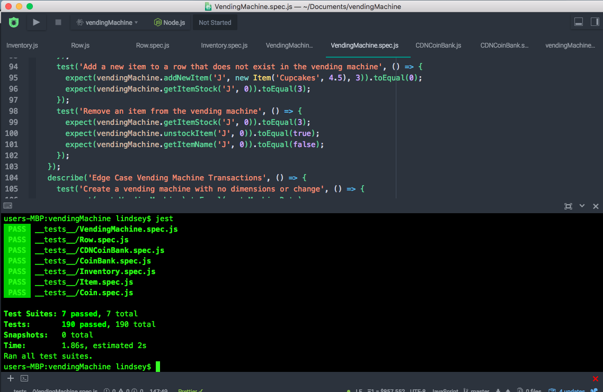

# VendingMachine
TDD Javascript Vending Machine

## About The Project

A Javascript class-based test-driven-design implementation of a vending machine.

### Screenshot


## Technologies

* JavaScript
* Node
* Jest

## Installation

Download the repo, then in its folder run:

```bash
npm install
```

## Testing

Test the code using Jest:

```bash
jest
```
The tests have been written to run sequentially as suites.

## Features

* Returns change as coins
* Dispenses the smallest number of coins when returning change
* Built modularly to accomodate any number of varied items
* Can localized to accept currencies other than CDN with few changes
* Prints inventory
* Dispenses inventory based on payment
* Has functionality for refilling inventory
* Has functionality for re-supplying change

## Future Plans

* Create an interface implementation (not native to Javascript) that would allow for more easeful internationalization
* Create a maximum inventory size and maximum change supply

